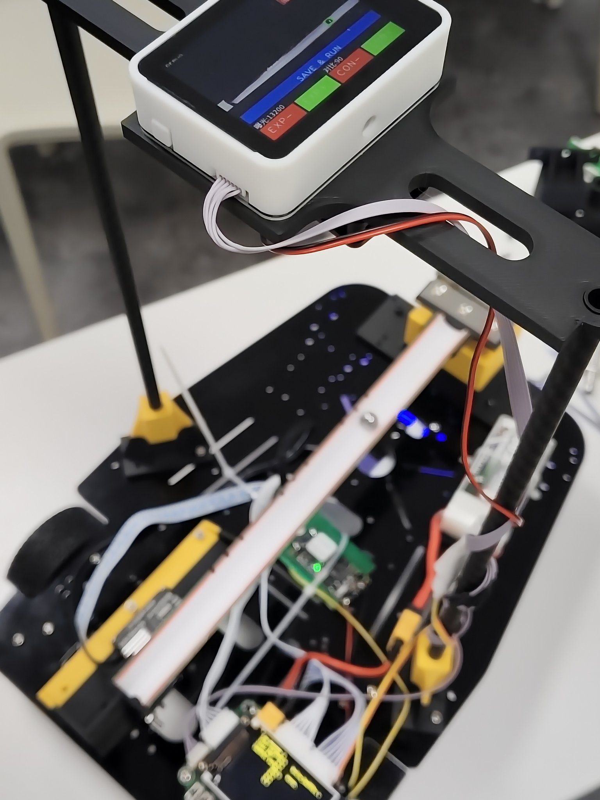
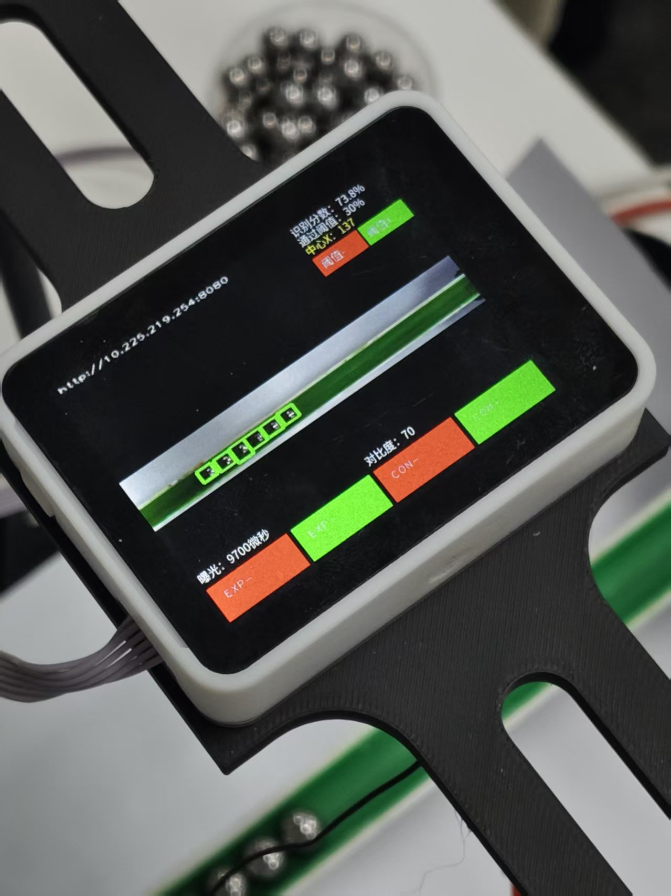
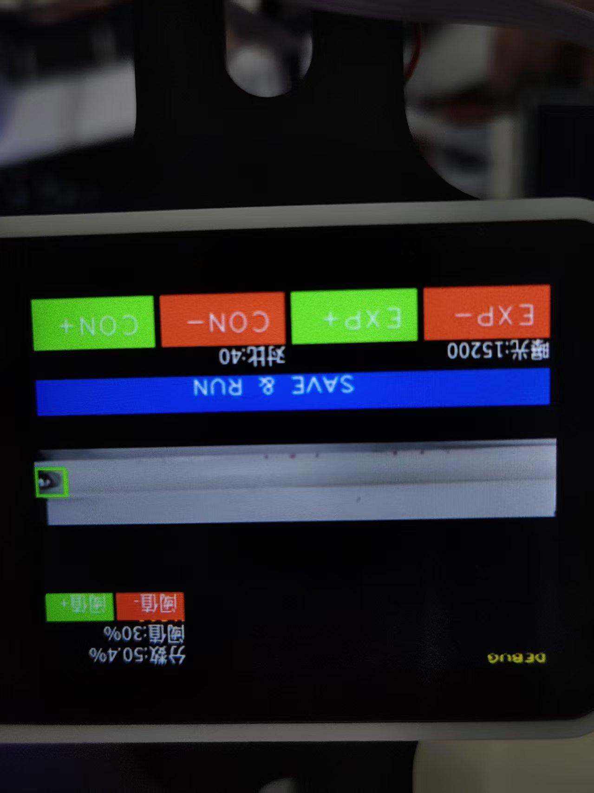

# 26UNEDC-Vision

2026 全国大学生电子设计竞赛机器人视觉项目。

本项目面向机器人钢球目标识别场景，在 MaixCAM Pro 上完成摄像头采集、YOLOv8 目标检测、目标位置计算、UART 数据发送以及本地/网页画面显示，为 MSPM0G3507 主控制器提供实时视觉信息。

## 项目亮点

- 完成“摄像头采集 → YOLOv8 检测 → 目标筛选 → 中心位置计算 → UART 通信”的完整视觉链路
- 使用 7000+ 张已标注钢球图像训练并测试 YOLOv8n、YOLOv8s 模型
- 完成数据增强、训练参数调整和实际场景误检问题排查
- 在 MaixCAM Pro 上部署模型，并使用 NPU 进行实时推理
- 通过带序号、有效标志、置信度和 CRC16 校验的固定长度数据包向 MSPM0G3507 发送检测结果
- 关闭屏幕图像刷新、保留采集、检测、坐标计算和通信流程时，最高测试速度约 70 FPS

## 项目效果

### 机器人视觉系统实物



### 钢球检测效果



### 设备运行界面



## 系统流程

```text
摄像头实时采集
        ↓
YOLOv8 钢球检测
        ↓
目标筛选与检测框解析
        ↓
计算目标中心位置
        ↓
通信协议封装
        ↓
UART 发送检测结果
        ↓
MSPM0G3507 主控制器
        ↓
机器人运动控制
```

视觉端负责识别钢球并计算目标位置，主控制器根据接收到的检测结果完成后续运动控制。

## 主要功能

### 实时目标检测

- 使用 MaixCAM Pro 摄像头采集 640×480 图像
- 通过独立检测通道缩放至模型输入尺寸
- 使用 YOLOv8 模型完成钢球检测
- 支持置信度、曝光和对比度调节
- 从候选目标中筛选最佳目标并计算中心位置

### 结果显示与网页预览

- 调试阶段在设备屏幕上显示检测框和运行参数
- 提供 MJPEG 网页预览，默认端口为 `8080`
- 支持在浏览器端录制预览画面
- 进入运行阶段后可关闭屏幕刷新，减少显示带来的性能开销

### UART 通信

视觉端通过 UART0 向主控制器发送检测结果，默认配置如下：

```text
设备：/dev/ttyS0
波特率：115200
TX：A16
RX：A17
```

通信数据包固定为 12 字节，包含：

- 帧头和协议版本
- 包序号
- 目标有效标志
- 目标中心横坐标
- 检测置信度
- CRC-16/CCITT-FALSE 校验

未检测到有效目标时，程序会清零坐标和置信度，并通过有效标志通知主控制器。

## YOLOv8 模型训练

### 模型与数据集

- 测试模型：YOLOv8n、YOLOv8s
- 数据量：7000+ 张钢球图像
- 数据集已完成目标框标注
- 训练过程中使用数据增强，并根据实际误检情况调整参数

### 主要训练参数

```text
epochs = 150
imgsz  = 320
batch  = 16
```

训练过程中综合比较模型的检测效果和运行速度，并将模型转换、打包为 MaixCAM Pro 可加载的 MUD/CVIModel 文件。

## 性能测试

测试平台：**MaixCAM Pro**

测试时保留以下完整流程：

- 摄像头实时采集
- YOLOv8 模型推理
- 检测框解析和目标筛选
- 目标中心位置计算
- UART 通信数据处理

在关闭设备屏幕图像刷新、其余视觉流程继续运行的情况下，最高测试帧率约为 **70 FPS**。

> 70 FPS 是特定模型和测试条件下的最高结果，实际帧率会受到模型大小、场景复杂度、摄像头配置和设备状态影响。

## 项目中遇到的问题

### 圆形物体误检

实际场景中的其他圆形物体可能被误识别为钢球。项目中通过补充干扰样本、调整数据增强和置信度阈值，并结合真实场景反复测试来降低误检。

### 显示刷新影响速度

设备屏幕绘制和刷新会占用额外资源。程序将调试显示与正式运行流程区分：调试阶段保留参数调节和画面显示，运行阶段关闭屏幕刷新并保持检测、计算和通信正常执行。

### 视觉端与控制端数据可靠性

为了让主控制器能够判断数据是否有效，通信协议加入包序号、有效标志、置信度和 CRC16 校验，避免直接发送裸坐标带来的歧义。

## 本人负责内容

- YOLOv8 钢球检测模型训练与测试
- 训练参数调整、数据增强和误检问题排查
- MaixCAM Pro 摄像头实时目标检测
- 检测框解析、目标筛选和中心位置计算
- 视觉端与 MSPM0G3507 主控制器之间的数据通信
- 设备端程序调试和性能测试
- 比赛过程中的视觉模块联调与问题排查

## 代码结构

```text
26UNEDC-Vision/
├─ assets/                 # 项目展示图片
├─ config/
│  └─ app.yaml             # MaixCAM 应用配置
├─ model/
│  ├─ model_6992.mud       # 模型描述与加载配置
│  └─ model_6992.cvimodel  # MaixCAM 端推理模型
└─ src/
   ├─ main.py              # 摄像头、检测、显示、网页服务和通信主流程
   ├─ detector.py          # YOLOv8 模型加载与推理
   ├─ comm_protocol.py     # UART 数据包、CRC16 校验与结果发送
   ├─ network_utils.py     # 本机 IP 地址获取
   └─ web_ui.py            # MJPEG 网页预览与浏览器端录制
```

## 运行说明

本项目面向 MaixCAM Pro 和 MaixPy 运行环境，需将 `src/`、`model/` 中的应用文件按 `config/app.yaml` 配置打包或复制到设备。模型默认优先从 MaixHub 安装目录加载，不存在时回退到应用包内的 `model_6992.mud`。

部署前请确认：

- 摄像头和屏幕能够被 MaixPy 正常识别
- UART0 引脚与 MSPM0G3507 接线一致
- 主控制器使用相同的波特率和通信协议
- 设备已连接网络（需要使用网页预览时）

## 说明

仓库中的模型文件和图片用于项目展示与设备端运行。训练数据集未包含在本仓库中。
